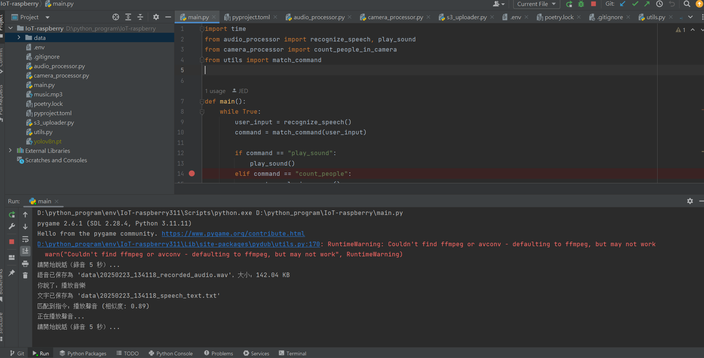

# 邊緣裝置 AI 設置與驗證

## NLP、STT 與影像處理技術

- **NLP 技術**: `paraphrase-multilingual-MiniLM-L12-v2`
- **STT 技術**: `Google Web Speech API`
- **影像人數偵測**: `yolov8n`

---

## Windows 11 環境建置

### 系統規格

- **CPU**: 12th Gen Intel(R) Core(TM) i7-12700H
- **RAM**: 48GB
- **GPU**: NVIDIA GeForce RTX 3060 Laptop GPU

### 環境建置

1. 安裝 Python 3.11
2. 安裝 Poetry
    
    ```
    pip install poetry
    poetry install
    ```
    
3. 執行 `main.py`
    
    ```
    import time
    from audio_processor import recognize_speech, play_sound
    from camera_processor import count_people_in_camera
    from utils import match_command
    
    def main():
        while True:
            user_input = recognize_speech()
            command = match_command(user_input)
    
            if command == "play_sound":
                play_sound()
            elif command == "count_people":
                count_people_in_camera()
            elif command is None:
                print("請再試一次或說得更清楚！")
            time.sleep(1)
    
    if __name__ == "__main__":
        main()
    ```
    

### 執行結果

- **播放音樂**



- **鏡頭人數計算**


---

## Raspberry Pi 環境建置

### 系統規格

- **裝置**: Raspberry Pi 3 Model B Plus Rev 1.3
- **相機**: 原廠 Camera
- **作業系統**: Debian GNU/Linux 12 (Bookworm)

### 系統資訊查詢

```
cat /etc/os-release  # 查詢 OS 版本
free -h  # 查詢記憶體資訊
df -h  # 查詢 SD 卡使用量
vcgencmd get_mem gpu  # 查詢 GPU 記憶體
```

### Python 3.11 環境建置

```
wget https://repo.anaconda.com/miniconda/Miniconda3-latest-Linux-aarch64.sh -O miniconda.sh
bash miniconda.sh
source ~/.bashrc
conda create -n py311-new python=3.11
source ~/miniconda3/bin/activate
conda activate py311-new
```

### 安裝相依套件

```
sudo apt-get install -y portaudio19-dev flac libcap-dev
pip install poetry
poetry install
```


### 執行 `main.py`

```
python main.py
```


### 運行與驗證

- **使用 mock 方式測試麥克風輸入**
    
    ```
    recognize_speech(mock_data="say_music.wav")
    ```
    
    ```bash
    import time
    from audio_processor import recognize_speech, play_sound
    from camera_processor import count_people_in_camera, count_people_in_camera_rpi
    from utils import match_command
    import os
    
    def main():
        while True:
            user_input = recognize_speech(mock_data="say_music.wav")
            command = match_command(user_input)
    
            if command == "play_sound":
                play_sound()
            elif command == "count_people":
                if os.name == "posix":
                    count_people_in_camera_rpi()
                else:
                    count_people_in_camera()
            elif command is None:
                print("請再試一次或說得更清楚！")
            time.sleep(1)
    
    if __name__ == "__main__":
        main()
    ```
    


### 人數偵測與 YOLOv8

鏡頭部分是使用原廠樹梅派鏡頭，yolov8n是可以跑得，因為以前研究3B+是跑不了yolov4的，但經驗證確定可行，模型也採用較輕量，只是花費時間約10幾秒


---

## 定時上傳 S3 設置

### 設定 Cron Job（每10分鐘執行一次）

```
*/10 * * * * cd /home/jed/IoT-AI && /home/jed/miniconda3/envs/py311-new/bin/python s3_uploader.py >> upload.log 2>&1
```

### 驗證上傳結果

- **確認 S3 上傳成功**


---


## 其他需安裝或者調整-Raspberry Pi(非Raspberry可跳過)

### 修正 `GLIBCXX_3.4.30` 問題

```
conda install -c conda-forge libstdcxx-ng=13
```

### 檢查 `libcamera` 與 `pykms`

```
ls /usr/lib/python3/dist-packages/libcamera
ls /usr/lib/python3/dist-packages/pykms
```

若缺少，請安裝並建立映射：

```
sudo apt install -y python3-libcamera python3-pykms
ln -s /usr/lib/python3/dist-packages/libcamera /home/jed/miniconda3/envs/py311-new/lib/python3.11/site-packages/libcamera
ln -s /usr/lib/python3/dist-packages/pykms /home/jed/miniconda3/envs/py311-new/lib/python3.11/site-packages/pykms
```

# 優化與設計部分

## 上傳文字檔案與語音檔案至 S3

### 現有作法

目前使用 Crontab 進行每五分鐘上傳。但在多個邊緣裝置上更新時間或程式邏輯時，會增加維護成本，且人工更新可能產生 Bug。

### 方案一：使用 AWS IoT Core

### **優勢**

- 透過 MQTT 協議，適合邊緣裝置使用。
- 邊緣裝置資料可傳至 AWS IoT，再由 Lambda 處理，統一管理邏輯。
- 無須在每個邊緣裝置更新程式邏輯，減少維護成本。

### **考量點**

- 需考慮檔案大小的壓縮，MQTT 不適合傳輸過大檔案。
- AWS IoT 無 QoS 3，無法完全保證交付，可能導致重複上傳。

---

## 語音辨識處理

### 現有作法

目前使用 Google API 進行 STT（語音轉文字），但若網路環境不佳，將無法正常運行。

### 方案一：在網路不佳時使用本地 STT 模型

### **優勢**

- 程式可監控網路品質，自動選擇使用 Google API 或本地模型處理 STT。

### **考量點**

- 測試過 Vosk 及其他語音辨識模型，辨識精準度仍有待提升。
- 需要時間測試與驗證，確保在邊緣裝置上能順暢運行模型。

---

## 模型整合與 Tools 維護

### 為何選擇 NLP 而非 LLM？

### **選擇 NLP 的理由**

- 適合邊緣裝置運行，輕量化，效能需求較低。
- 符合環境限制，降低資源消耗。

### **何時考慮 LLM？**

- 當應用需求擴展，例如：
    - 新增其他 Tools
    - 需要記憶功能或向量資料庫應用
- 可使用 LLM API，並結合 LangChain 進行開發，以提升靈活性與可擴展性。
